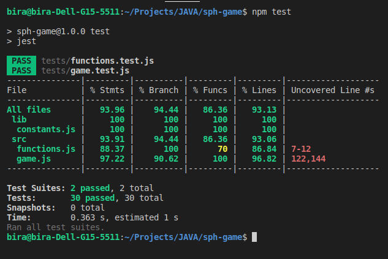
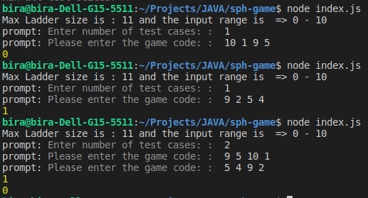

# Ladder Warriors 

## Game config
    Set ladder length: ./lib/constants.js - LADDER_SIZE: 11 (steps 0-10)

## Run the application
    node index.js (unix)
    npx test - unit test & code coverage

## Logic

    landed players to the ladder: 11 3 6 8 : [ 'OP', 'OP', 'OP', 'OP', 0, 0, 0, 'YP', 'YP', 'YP', 'YP' ]
    - Loop until no zeros.
        - Check for able to decide the winner
        - Move Old player
        - Check for able to decide the winner
        - Move Young Player 
        - Check for able to decide the winner
    

## Screenshots

    

